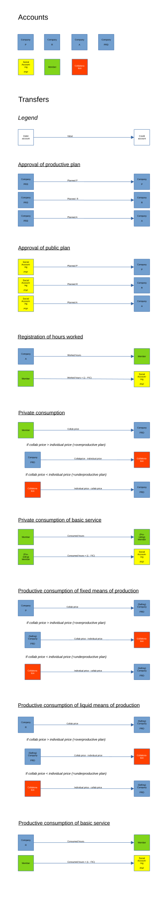

Core Concepts
==============

Labour time accounting prevents the exploitation of others' work by recording every transfer of working hours through bookkeeping between accounts. The accounts belong to different types of users, which guarantees accountability.

Users
-----

There are three types of users:

* **Companies** file plans for the products and services they offer. They may join cooperations with other companies producing the same product. Companies consume products from other companies' plans and basic services from members, and they register members' worked hours, which credits work certificates to those members.

* **Members** are individual workers. They earn work certificates by working for a company or by offering basic services. They consume products from companies' plans and basic services from other members.

* **Accountants** review and approve or reject company plans based on collectively agreed criteria.

Accounts
--------

The app has seven account types. See :ref:`transfers-of-labour-time` for a list of allowed transfers between them.

.. list-table::
   :widths: auto
   :header-rows: 1

   * - Account
     - Owner
     - Description
   * - p
     - Company
     - Hours allocated to the company for fixed means of production (German: *Produktionsmittel*) — e.g. machines or buildings, which transfer their value to the product gradually over multiple planning cycles. Credited on approval of a plan, debited as the company consumes fixed means of production.
   * - r
     - Company
     - Hours allocated to the company for liquid means of production (German: *Rohstoffe* — raw materials), which transfer their value to the product within a single planning cycle. Credited on plan approval, debited as the company consumes liquid means of production.
   * - a
     - Company
     - Hours allocated to the company for labour (German: *Arbeit*). Credited on plan approval, debited as the company registers worked hours.
   * - prd
     - Company
     - Tracks planned and delivered products (German: *Produkt*). When a productive plan is approved, the total planned cost is debited from this account; as the product is consumed in exchange for work certificates, the balance returns toward zero.
   * - member
     - Member
     - Tracks a member's work certificates: credited when they work for a company or when their basic service is consumed, debited when they consume a product or service.
   * - psf
     - Social Accounting
     - Public Sector Fund — tracks hours credited to and debited from the public sector. Currently the app has a single Social Accounting instance with one psf account.
   * - cooperation
     - Cooperation
     - Accumulates the deltas between cooperative price and individual product cost on each consumption of a cooperating plan (see :ref:`cooperations`).

Overview
--------

.. _plans:

Plans
-----

A plan describes a product to produce, the planned timeframe, and the planned production cost in hours. Plans are either *productive* — their products are consumed in exchange for work certificates — or *public* — their products are freely available.

A company first creates a *plan draft*. Filing the draft with Social Accounting turns it into a plan, which can then be approved or rejected. An approved plan is "active" until its expiration date (approval date plus planned timeframe); after that, no further consumption can be registered against it.

On approval, the planned hours for fixed means of production, raw materials, and labour are credited to the company's P, R, and A accounts. The corresponding amount is debited from the company's own PRD account (productive plan) or from Social Accounting's PSF account (public plan).

.. _basic-services:

Basic Services
--------------

A basic service (BS) is an offering by an individual worker (member).

Differences from plans:

* Only members can create basic services; companies represent their services via plans.
* Unlike plans, which may involve objectified labour (means of production, raw materials), a basic service represents purely living labour: a worker offers their personal time and skills directly to others.
* No fixed duration and no planned quantity (no "X units per hour").
* No approval by Social Accounting is required; a basic service is searchable immediately upon creation.
* No cooperative price mechanism.

Consumption
-----------

Workers Control distinguishes *productive consumption* (a company consumes for its production process) from *private consumption* (a member consumes for personal use). Either kind of consumption can target a planned product or a basic service. Companies cannot consume products from public plans.

For each combination, the cost — the cooperative price where applicable — flows as follows:

.. list-table::
   :widths: auto
   :header-rows: 1

   * - Consumer
     - Consumed
     - Debited
     - Credited
   * - Company (productive)
     - Planned product
     - Consuming company's P or R account, depending on whether the product is acquired as a fixed or liquid means of production
     - Producing company's PRD
   * - Member (private)
     - Planned product
     - Consuming member's account
     - Producing company's PRD
   * - Company (productive)
     - Basic service
     - Consuming company's R account (basic services count as liquid means of production)
     - Providing member's account
   * - Member (private)
     - Basic service
     - Consuming member's account
     - Providing member's account

.. _certificates-and-fic:

Labour Certificates and Factor of Individual Consumption (FIC)
--------------------------------------------------------------

A member's account is credited with work certificates in two ways: when a company registers their worked hours, or when another user consumes a basic service they offer. In both cases the member receives certificates equal to the hours of living labour they contributed.

At the same time, a portion of those certificates is transferred from the member's account to the PSF account in order to fund public plans. For :math:`h` hours of contributed labour, :math:`h \cdot (1 - \text{FIC})` certificates are deducted. The Factor of Individual Consumption (FIC) is calculated as:

.. math::

  \text{FIC} = \frac{L-(P_o + R_o)}{L + L_o}

where :math:`L` is the total working hours in productive plans plus the working hours of basic services consumed within the calculation window, :math:`L_o` is the total working hours in public plans, and :math:`P_o` and :math:`R_o` are the totals of fixed and liquid means of production in public plans.

The FIC ranges from 0 to 1:

* **FIC = 0**: all labour is allocated to public plans, so all goods and services are freely available. Members net zero certificates from work or from basic services — their entire contribution funds public-sector goods and cannot be exchanged for private consumption.
* **FIC = 1**: all labour is allocated to productive plans, and nothing is freely available. Certificates are credited in full without deduction.

**Calculation window.** The window spans :math:`t` days, from :math:`t/2` in the past to :math:`t/2` in the future. Plans contribute weighted by overlap: a plan that lies entirely within the window contributes 100% of its planned costs; one that overlaps 50% contributes 50%; one fully outside contributes nothing. Consumed basic services are point-in-time events and contribute to :math:`L` in full if their consumption date falls within the window, and not at all otherwise.

.. _cooperations:

Cooperations
------------

Companies that produce the same product can attach their plans to a *cooperation*. Cooperations are how companies in an industry express the intention to overcome competition and align their production. The first step toward such alignment is a shared *cooperative price* — the average labour cost per product across all cooperating plans. This is what consumers pay regardless of which plan supplied their item:

.. math::

  \text{cooperative price} = \frac{1}{n} \sum_{i=1}^{n} \frac{\text{cost}_i}{\text{pieces}_i}

where :math:`\text{cost}_i` and :math:`\text{pieces}_i` are the total planned cost and total pieces of the :math:`i`-th of the :math:`n` plans in the cooperation. The cooperative price thus approximates the socially necessary cost of the product.

**Productivity and compensation.** A plan that needs more labour per product than the average is *underproductive*; one that needs less is *overproductive*. When such a product is consumed, the consumer spends fewer or more certificates than the plan's individual cost. To track this, compensation transfers between the producing company and the cooperation account are recorded on each consumption (see :ref:`transfers-of-labour-time`).

**Coordinators.** A cooperation begins empty; any company can create one and automatically becomes its *coordinator*. Coordinators accept or deny incoming cooperation requests, remove plans from the cooperation, and can transfer the role to another company. The history of past coordinators is visible to all users.

The app provides only the technical front-end; the political processes by which coordinators are chosen happen outside it. Companies dissatisfied with a given coordination can always create a new cooperation.

.. _transfers-of-labour-time:

Transfers of labour time
------------------------

A transfer charges the *debit* account and credits the *credit* account. The table below lists every allowed transfer along with the variable name used in code.

.. list-table::
   :widths: 10 20 20 60
   :header-rows: 1

   * - Variable name
     - Debit account
     - Credit account
     - Explanation
   * - credit_p
     - prd
     - p
     - On approval of a productive plan, the planned hours for fixed means of production are subtracted from the PRD account of the company and added to the P account of the company.
   * - credit_r
     - prd
     - r
     - On approval of a productive plan, the planned hours for liquid means of production are subtracted from the PRD account of the company and added to the R account of the company.
   * - credit_a
     - prd
     - a
     - On approval of a productive plan, the planned hours for labour are subtracted from the PRD account of the company and added to the A account of the company.
   * - credit_public_p
     - psf
     - p
     - On approval of a public plan, the planned hours for fixed means of production are subtracted from the PSF account and added to the P account of the company.
   * - credit_public_r
     - psf
     - r
     - On approval of a public plan, the planned hours for liquid means of production are subtracted from the PSF account and added to the R account of the company.
   * - credit_public_a
     - psf
     - a
     - On approval of a public plan, the planned hours for labour are subtracted from the PSF account and added to the A account of the company.
   * - private_consumption
     - member
     - prd
     - On private consumption, the cost of the product (the cooperative price, if applicable) is subtracted from the consuming member's account and added to the PRD account of the producing company.
   * - private_consumption_of_basic_service
     - member
     - member
     - On private consumption of a basic service, the consumed hours are subtracted from the consuming member's account and added to the account of the member providing the service.
   * - productive_consumption_p
     - p
     - prd
     - On productive consumption of fixed means of production, the cost of the product (the cooperative price, if applicable) is subtracted from the P account of the consuming company and added to the PRD account of the producing company.
   * - productive_consumption_r
     - r
     - prd
     - On productive consumption of liquid means of production, the cost of the product (the cooperative price, if applicable) is subtracted from the R account of the consuming company and added to the PRD account of the producing company.
   * - productive_consumption_of_basic_service
     - r
     - member
     - On productive consumption of a basic service, the consumed hours are subtracted from the R account of the consuming company (basic services count as liquid means of production) and added to the account of the member providing the service.
   * - compensation_for_coop
     - prd
     - cooperation
     - On private or productive consumption, if the consumed plan was overproductive, the delta between cooperative price and individual product cost is subtracted from the PRD account of the planning company and added to the cooperation account.
   * - compensation_for_company
     - cooperation
     - prd
     - On private or productive consumption, if the consumed plan was underproductive, the delta between cooperative price and individual product cost is subtracted from the cooperation account and added to the PRD account of the planning company.
   * - work_certificates
     - a
     - member
     - On registration of worked hours, the hours are subtracted from the A account of the company and added to the member's account.
   * - taxes
     - member
     - psf
     - On registration of worked hours and on private or productive consumption of a basic service, :math:`h \cdot (1 - \text{FIC})` are subtracted from the working/providing member's account and added to the PSF account (see :ref:`certificates-and-fic`).
